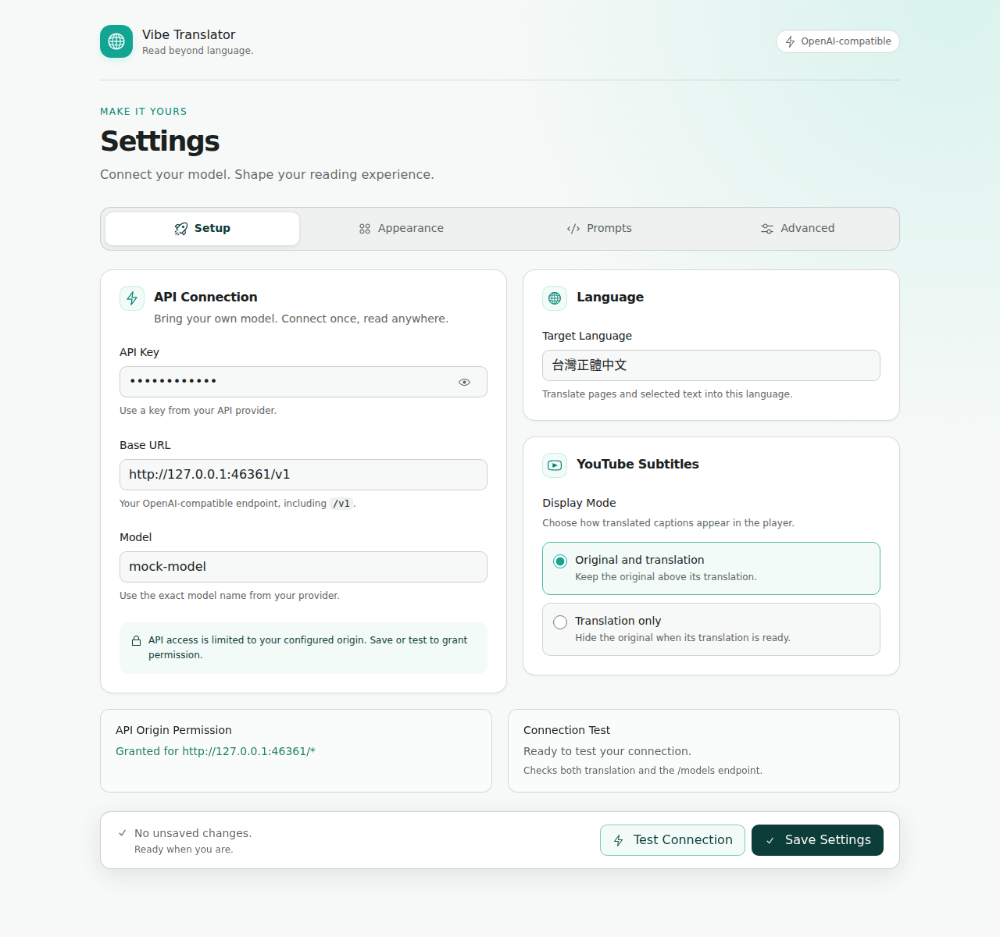
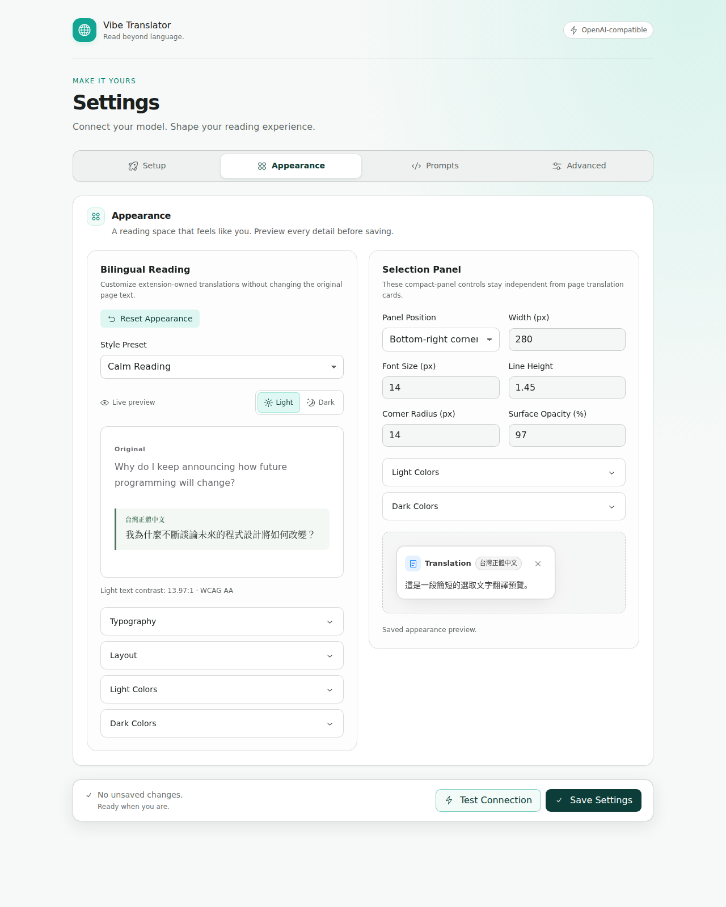
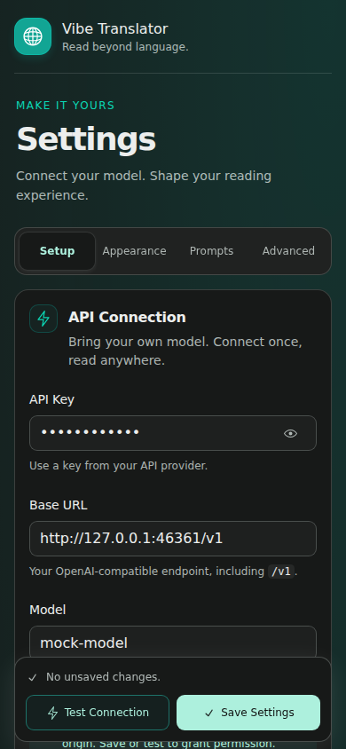

# Playwright E2E Tests

This repository includes Playwright E2E scripts that copy and load the production `dist/chrome` artifact and exercise the real MV3 runtime.
Run `npm run build` first; the browser loads packaged extension entrypoints, not raw entrypoints from `src/`. Each run launches one persistent Chromium context and discovers the extension ID from that context's service worker, without a preliminary browser restart.

## Smoke Coverage

1. Opens the extension options page
2. Saves API settings from environment variables or `.env`
3. Copies `dist/chrome` into a temporary extension directory and adds only test host permissions to that copy
4. Runs **Test Connection**
5. Opens `test/fixture-page.html`
6. Triggers full-page translation through a validated extension runtime command
7. Scrolls a nested overflow container and verifies newly visible text is queued
8. Triggers selected-text translation through the same background controller used by user entrypoints
9. Verifies bundled background, content, and options health without requiring private globals
10. Saves screenshots in `e2e-artifacts/`

## Options UI Regression Coverage

The dedicated options regression loads the packaged React and Radix UI and exercises keyboard-correct tabs, API-key visibility, drafts, prompt resets, persistence, permission status, connection failure/retry, and duplicate-action guards. Native and application validation must reveal the relevant tab, expand a closed Appearance disclosure when needed, and focus the invalid field.

All numeric Appearance controls must match `APPEARANCE_LIMITS` and retain their expected input steps. Simultaneous validation errors must retain field-focus priority and clear only the edited field's invalid state.

Every tab is checked in light and dark modes at 320, 390, 720, and 1280 px. The suite verifies save actions remain inside the viewport and unobscured at the top, middle, and bottom of the page, and checks preview bounds, 200% zoom, reduced-motion animation styles, and forced colors. It runs axe in both themes, inspects the Chrome accessibility tree, enforces a 500 ms local render budget, and rejects remote UI resources or console errors.

Screenshots in `e2e-artifacts/` include each tab in both themes, `radix-options-light.png`, `radix-options-appearance.png`, and `radix-options-dark-mobile.png`. Screen-reader announcement quality and Chrome's native permission prompt still require the manual options checklist in [TESTING.md](TESTING.md).

```bash
PLAYWRIGHT_HEADLESS=1 npm run e2e:options
```







## PDF Reader Regression Coverage

```bash
PLAYWRIGHT_HEADLESS=1 npm run e2e:pdf
```

The PDF suite uses local fixtures and a mock API to check progressive rendering, partial failure/retry, source highlighting, copy/search, navigation, pause/resume, reload caching, encrypted document replacement, malformed files, password cancellation, and session cancellation. It also checks narrow-viewport geometry and axe accessibility.

A test-only reader port wrapper delivers each translation update twice and changes one block's translation to an empty string. Completion counts must remain unique; completed blocks, including the empty result, must not be requeued after navigation or resume. After reload, nonempty results must come from the PDF cache without queue messages; the empty result remains uncached. The wrapper changes no production code and records only fixture block IDs and counters.

## Antirez Comment Regression Coverage

The Antirez regression opens `https://antirez.com/news/169`, translates the article and its cross-origin Disqus frame, and verifies loaded comment paragraphs receive inline notes:

```bash
PLAYWRIGHT_MOCK_API=1 npm run e2e:antirez
```

## YouTube Subtitle Regression Coverage

The YouTube regression opens `https://www.youtube.com/watch?v=g7AxxkywiFI`, uses the production manifest's YouTube host permission, installs deterministic auto-generated caption metadata and native `.ytp-caption-segment` DOM fixtures inside the real YouTube player, and clicks the in-player Vibe Translator icon. It verifies the safe diagnostic panel, bounded control placement, active state, continuous replacement of native captions, compact player rendering, and rejection of late results from replaced cues:

```bash
npm run e2e:youtube
```

## Syosetu Regression Coverage

The repository also includes a dedicated regression script for Syosetu directory pages:

1. Opens `https://ncode.syosetu.com/n6093en/`
2. Triggers full-page translation from the background service worker
3. Scrolls through the directory page so long episode lists can settle
4. Verifies that the summary, chapter titles, and episode titles are translated
5. Verifies that episode metadata, pager UI, and recommendation blocks stay untranslated

## Why It Uses Controller Commands

The smoke suite intentionally avoids Chrome's toolbar button and native context menu because those browser UI surfaces are harder to automate reliably.
An extension options-page bridge sends validated internal commands to the background controller, so tests use the same page and selection orchestration as toolbar and context-menu entrypoints without accessing private worker globals.

The test still exercises the real extension stack:

1. Bundled MV3 module service worker
2. Bundled content script injection and frame routing
3. Bundled options entrypoint used by prompt preview and Test Connection
4. `chrome.storage` settings
5. Host permission checks
6. Real API requests
7. DOM rendering on the target page

## Required Environment Variables

Put these in `.env` or export them in your shell:

```bash
OPENAI_API_KEY=...
OPENAI_BASE_URL=https://api.openai.com/v1
OPENAI_MODEL=gpt-4.1-mini
TARGET_LANGUAGE=台灣正體中文
```

For local smoke testing without a real API key, use the mock OpenAI-compatible API mode instead. The mock mode starts a local `/v1/models` and `/v1/responses` server and seeds the extension with its base URL:

```bash
npm run e2e:mock
```

## Optional Environment Variables

```bash
PLAYWRIGHT_BROWSER_CHANNEL=chromium
PLAYWRIGHT_CHROME_EXECUTABLE=/custom/path/to/chrome
PLAYWRIGHT_USER_DATA_DIR=.e2e-user-data
PLAYWRIGHT_ARTIFACTS_DIR=e2e-artifacts
PLAYWRIGHT_HEADLESS=0
PLAYWRIGHT_MOCK_API=0
```

If `PLAYWRIGHT_USER_DATA_DIR` is unset, the suite uses a temporary Chromium profile and removes it after the run. Set `PLAYWRIGHT_USER_DATA_DIR=.e2e-user-data` when you want to keep the seeded permission and extension state between runs.

If `PLAYWRIGHT_HEADLESS` is not set, the script defaults to headed mode. Headless mode also works, because the test harness seeds the API origin permission before the main run.
If `PLAYWRIGHT_CHROME_EXECUTABLE` is unset, the suite uses Playwright's `chromium` channel because that is the supported path for loading unpacked extensions.

## Font Requirements

Some sites need CJK fonts to render Japanese or Traditional Chinese correctly in Playwright.

On Linux, install a CJK font package before running E2E tests. For example:

```bash
sudo apt-get update
sudo apt-get install -y fonts-noto-cjk fonts-noto-color-emoji
```

You can verify font availability with:

```bash
fc-list :lang=ja
fc-list :lang=zh-tw
```

If these return no results, some pages may show missing glyphs even when the page encoding is correct.

## Install

```bash
npm install
npm run build
```

## Run

```bash
npm run e2e:smoke
```

```bash
npm run e2e:mock
```

```bash
PLAYWRIGHT_HEADLESS=1 npm run e2e:options
```

```bash
npm run e2e:syosetu
```

```bash
npm run e2e:antirez
```

Or, using the project command wrapper:

```bash
just e2e
just e2e-mock
just e2e-syosetu
```

## Notes

1. The smoke suite is intentionally minimal and uses `test/fixture-page.html`.
2. `npm run e2e:syosetu` is a live-site regression test and depends on the current Syosetu page structure.
3. The harness modifies only its temporary artifact copy; `dist/chrome/manifest.json` remains unchanged.
4. Production paths are derived from the generated manifest and service-worker discovery.
5. For lifecycle validation, run twice with independent temporary profiles: `PLAYWRIGHT_HEADLESS=1 npm run e2e:mock && PLAYWRIGHT_HEADLESS=1 npm run e2e:mock`.
6. Options UI screenshots are review artifacts and are not loaded by the extension.
